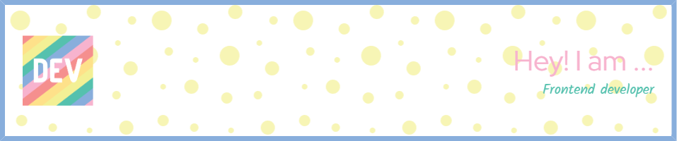

# Hi there! 👋 I'm Anisubhra

                                        

### 🎯 About Me

Crafting **seamless, high-performance, and visually appealing web applications** is my passion as a Senior Front-End Engineer. I'm a **creative and detail-oriented** developer, dedicated to building **intuitive user interfaces** and **exceptional user experiences**. 

I **explore modern frameworks, design principles, and performance optimization** to **push the boundaries** of web development.

### 💼 Portfolio

Take a look at my portfolio to see some of my favorite projects:

💻 Checkout my work → [Portfolio Website](https://portfolio-website-umber-pi.vercel.app/)

### 🤝 Let's Connect

I'm always open to new collaborations, exciting projects, and networking with fellow devs. Reach out to me through:

 

### 📫 Contact Me

📩 Email me at → [anisubhrasarkar@gmail.com](mailto:anisubhrasarkar@gmail.com)

### 🎉 Fun Facts

- 🎨 I love experimenting with CSS to create unique, dynamic, and eye-catching designs.
- 🔥 Always on the lookout for the latest design trends and frontend tech.
- 🎮 When I'm not coding, you'll find me gaming, drawing, or geeking out over new tech.

Thanks for stopping by! Feel free to explore my repos, drop a star ⭐, or contribute to any project that catches your eye.

Happy coding! 🚀✨
