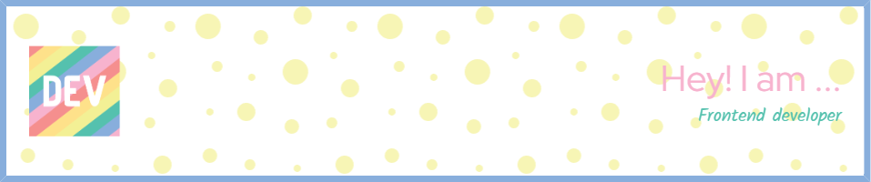

# Hi there! 👋 I'm Anisubhra

Passionate Frontend Developer | UI/UX Enthusiast | Code Explorer

Welcome to my GitHub profile! I'm a creative and detail-oriented front-end developer with a knack for crafting seamless and visually appealing user interfaces. My journey in the world of coding has been a fascinating exploration, and I'm always eager to learn and adapt to new technologies.

## 🚀 Skills

- **Languages:** HTML, CSS, JavaScript (ES6+)
- **Frameworks/Libraries:** React, Redux, Next.js Angular, GraphQL, React Native
- **Styling:** Sass, Styled Components, Tailwind, Bootstrap
- **Tools:** Git, Docker, CI/CD
- **Design:** Figma, Adobe XD

## 💼 Portfolio

Check out my portfolio to see some of my latest projects and a showcase of my skills:

[Portfolio Website](https://portfolio-website-umber-pi.vercel.app/)

## 🔧 Projects

Here are some projects I'm proud of:

1. [Genius](https://ai-saas-pi-orpin.vercel.app/) - An AI SaaS platform built from scratch that leverages OpenAI and Replicate to generate unique media content.
2. [Threads Clone](https://threads-app-ochre.vercel.app/) - Full-stack threads clone app which has features like search, activity, create, community, profile details etc.
3. [Metaversus](https://metaverse-landing-vert.vercel.app/) - Metaverse landing app with fully responsive design, modern UI elements and fluid animations.
4. [HooBank](https://bank-landing-app.vercel.app/) - A modern banking landing website designed and developed from figma design which is not only lightweight but pixel perfect and works seamlessly across all the devices.

## 🤝 Let's Connect

I'm open to collaboration and networking. Feel free to reach out to me through:

- [LinkedIn](https://www.linkedin.com/in/anisubhrasarkar/)
- [Twitter](https://twitter.com/anisubhrasarkar)

## 📫 How to Reach Me

You can email me at [anisubhrasarkar@gmail.com](mailto:anisubhrasarkar@gmail.com).

## 🎉 Fun Facts

- I love experimenting with CSS to create unique and eye-catching designs.
- I'm an avid learner, always exploring new technologies and design trends.
- When I'm not coding, I enjoy playing video games, watching movies, drawing, and exploring new tech.

Thanks for stopping by! Feel free to explore my repositories and don't hesitate to drop a star or contribute if you find something interesting. Happy coding! 👩‍💻🚀
